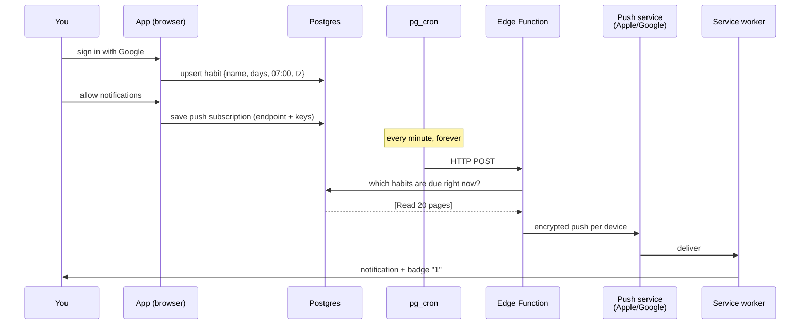
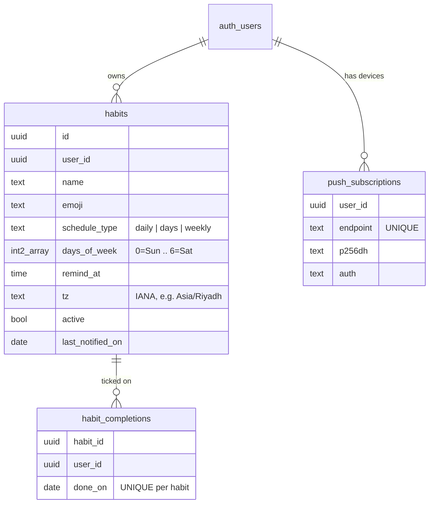
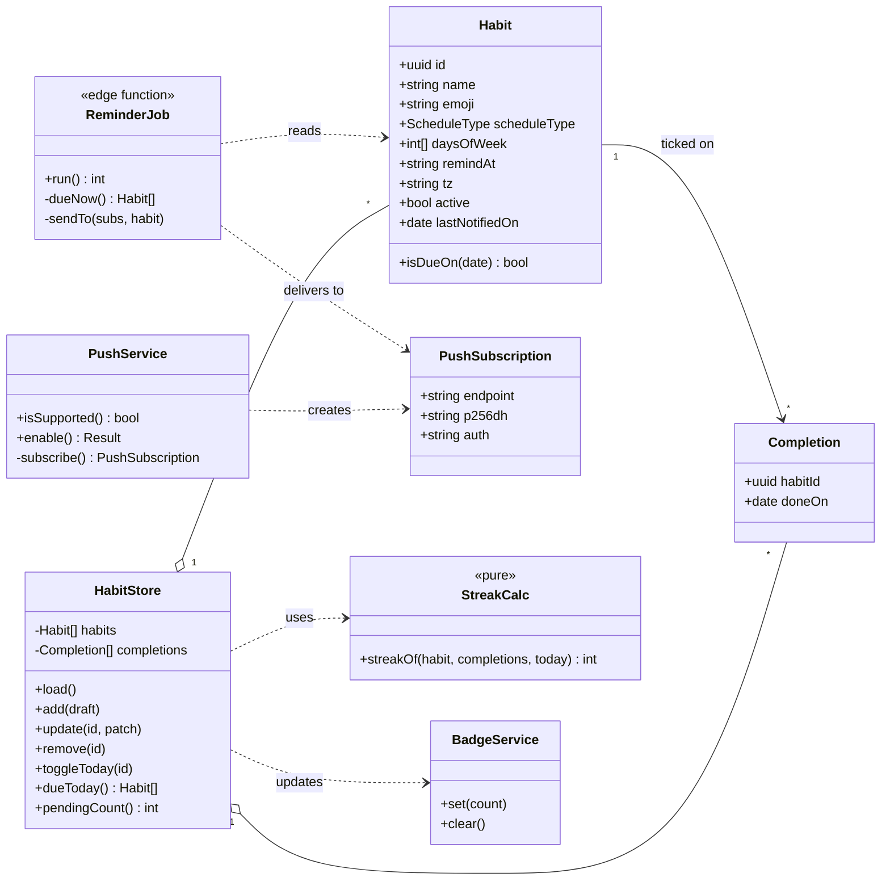
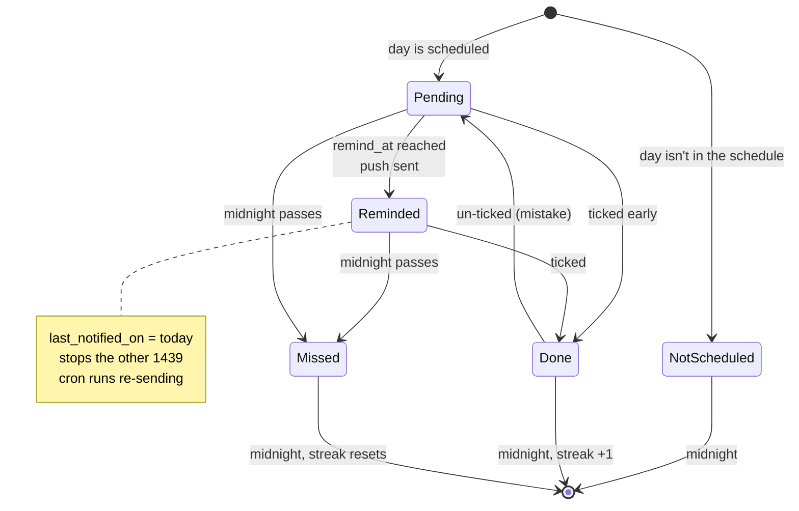
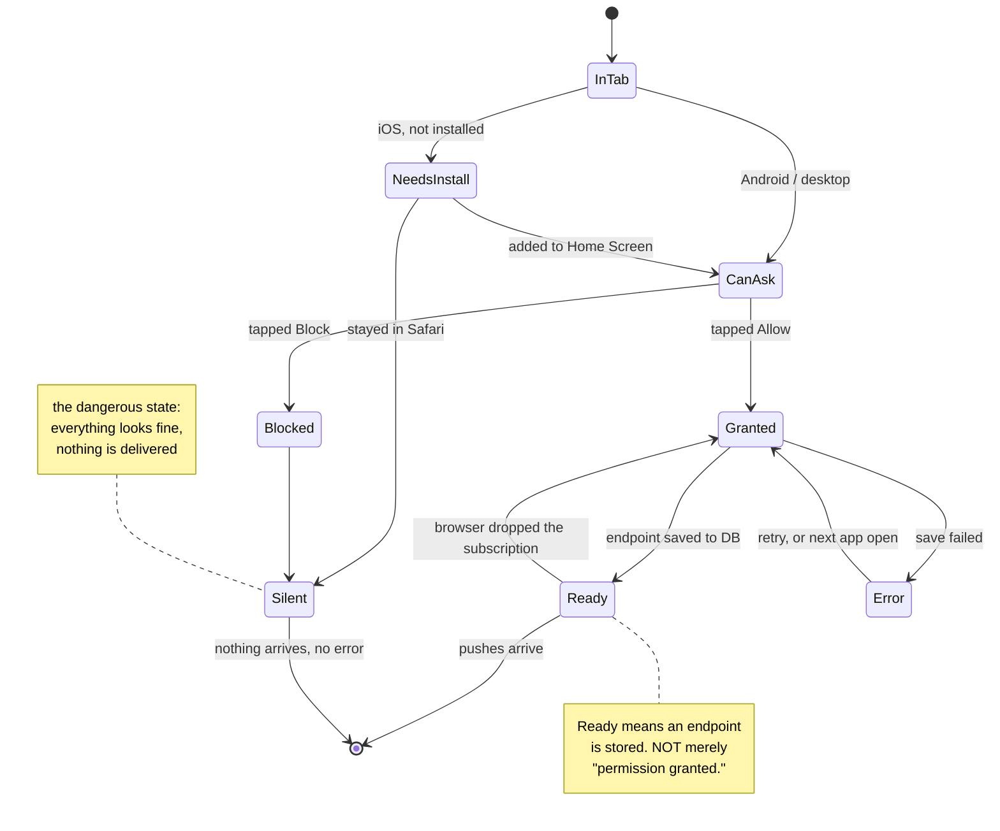
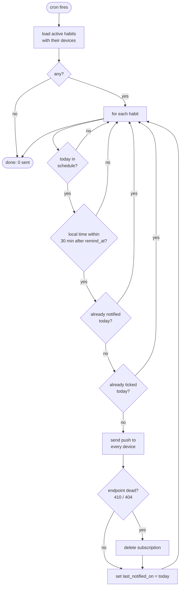
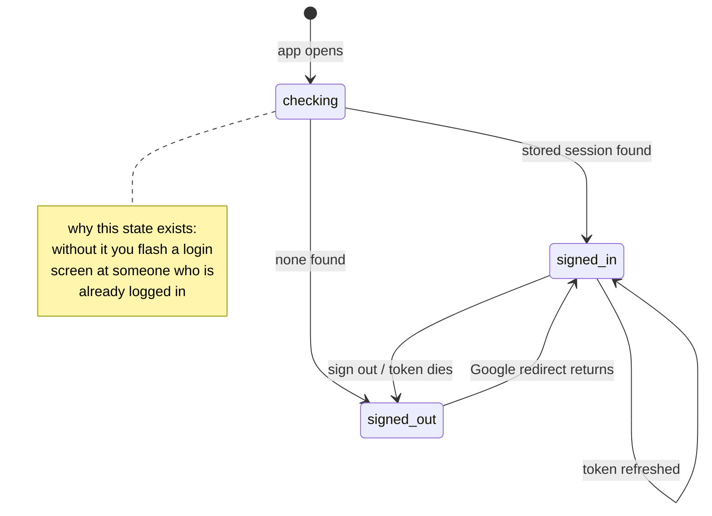
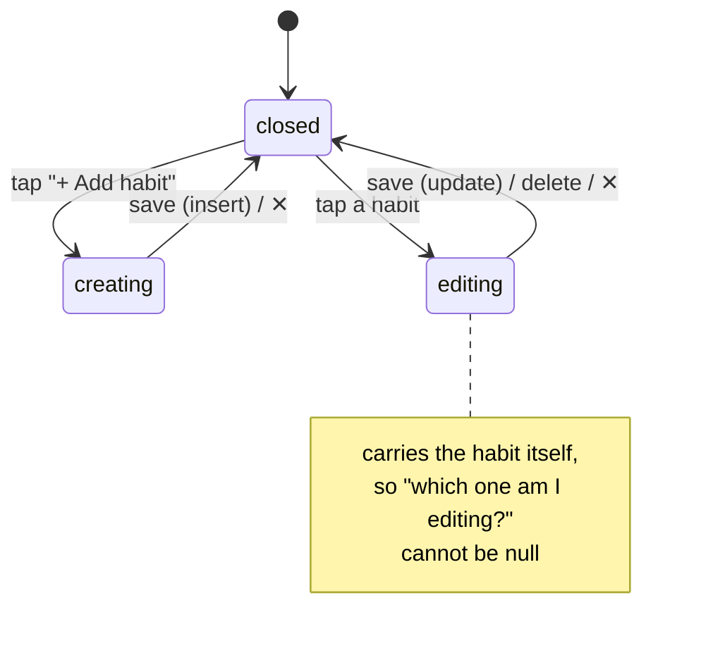
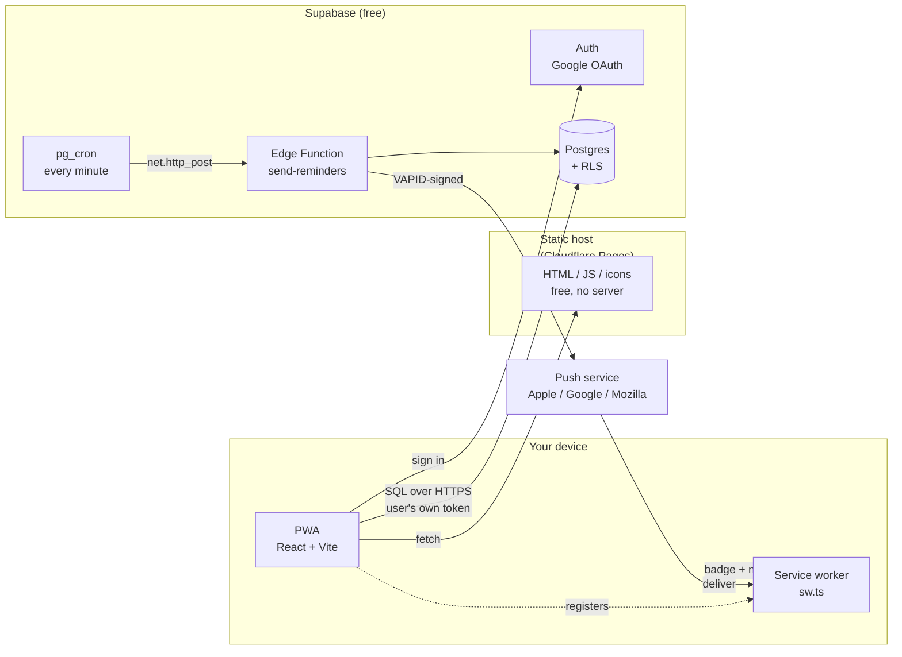

# Habit Tracker — design

An app you install on your phone and your computer. You add habits. It reminds you.
You tick them off. It counts your streak.

Written before the code. Updated after. If code and this file disagree, the code is a bug.

---

## 1. The thing that makes this hard

You would think a web app can say "wake me at 7am tomorrow." **It cannot.**

```
  What you'd expect                    What actually exists
  ─────────────────                    ────────────────────
  setTimeout(remind, 8h)   ✗  the browser tab is closed
  service worker timer     ✗  the OS kills idle workers in seconds
  Notification Triggers    ✗  never shipped; removed from Chrome
```

A service worker is not a program that runs. It is a **doorbell**. It sleeps until
something outside rings it. So something outside must ring it.

```
        needs a clock that never sleeps
                     │
                     ▼
              ┌─────────────┐
              │   SERVER    │  ← the only thing awake at 7am
              └──────┬──────┘
                     │ Web Push
                     ▼
              ┌─────────────┐
              │ service     │  ← wakes up, shows the notification
              │ worker      │
              └─────────────┘
```

**Consequence:** every reminder is a server-sent push. There is no offline reminder.
Habits and tick-offs work offline; *reminders* need the server to be up.

## 2. The second hard thing: iPhones

On iOS, web push works **only if the app is on the Home Screen**. In a Safari tab you
get nothing — no error, no prompt, just silence.

```
  iPhone, Safari tab        iPhone, Home Screen        Android / Desktop
  ──────────────────        ───────────────────        ─────────────────
  push    ✗                 push    ✓ (iOS 16.4+)      push    ✓
  badge   ✗                 badge   ✓                   badge   ✓
```

So "Add to Home Screen" is not a nice-to-have banner. It is **step 1 of onboarding**,
before we even ask for notification permission. `NotificationSetup` handles it: in a
Safari tab `pushState()` returns `needs-install` and the app says so, rather than
offering a permission button that cannot work.

*(An earlier draft of this file said we reuse `IosInstallSheet` from `salat-time`. We
never did — the state in `NotificationSetup` replaced the need for a separate sheet.)*

**Verified on an iPhone 13**, in this order — and the order is not advice, it's a
requirement:

```
  1  open the deployed URL in Safari
  2  Share → Add to Home Screen
  3  open from the ICON, not Safari      ← the step people skip
  4  sign in with Google
  5  allow notifications
```

Step 3 matters because a Safari tab and an installed PWA are **separate storage
contexts**. Sign in inside the tab, then install, and the app opens signed out.

### The second permission gate nobody documents

Granting notifications in the browser is not enough. The operating system has its own
switch, and its own idea of how to display them:

```
  site permission granted    ✓  the app asked, you tapped Allow
  OS allows the app          ?  System Settings → Notifications
  OS alert style             ?  None / Banners / Alerts
                                └─ "None" still files them in Notification Centre,
                                   so they arrive and are never seen
```

We hit both on macOS: first no delivery at all, then delivery that only appeared in
Notification Centre. Neither produces an error the app can detect — which is why the
UI offers "Send a test" instead of claiming reminders are on.

## 3. How a reminder actually travels



"Due right now" means all four are true:

```
  ┌─ active                                     habit not paused
  ├─ today matches the schedule                 daily / Mon,Wed / weekly
  ├─ local time is in [remind_at, +30 min)      07:00–07:30 in Asia/Riyadh
  └─ not already notified today                 last_notified_on <> today
```

That last line is the one that stops duplicate pings. Cron runs 1440 times a day; the
flag is what makes 1439 of those runs do nothing.

**Why a window and not an exact minute.** The first version matched the minute exactly.
That meant one late or skipped cron run lost the reminder for the entire day, silently —
the worst possible failure for the only feature that matters. A window fires on the
first sweep at or after the chosen time:

```
  exact match          07:00 ──┐
                               └─ cron ran at 07:01 → nothing, all day

  window               07:00 ──┬──────────────── 07:30
                               └─ cron ran at 07:01 → sent, 1 min late
```

A reminder four minutes late is useful. One that never arrives is not.

The comparison is done in **seconds since midnight**, not `remind_at + interval
'30 minutes'`, because time arithmetic wraps: `23:50 + 30min` is `00:20`, which makes a
range read backwards and match nothing. Seconds can't wrap — and a habit set near
midnight just gets a shorter window instead of a broken one.

## 4. Data

Three tables. No user profile table — a Supabase trigger to create one is extra
machinery we can avoid.



Why `tz` sits on the habit, not the user: it means one table instead of two and no
signup trigger. Cost — if you fly to another country your habits still fire on the old
clock until you edit them. Marked in code as a known ceiling.

Why `done_on` is a `date` and not a timestamp: a habit is done *today* or it isn't.
Storing the exact second invites timezone bugs and buys nothing.

**Security:** every table has row-level security — `user_id = auth.uid()`. The browser
talks to Postgres directly with the user's own token, so the database refuses to hand
over anyone else's rows. There is no API layer to get this wrong in.

## 5. Streaks and the badge

```
  Habit: "Read 20 pages"     scheduled Mon Tue Wed Thu Fri
  ─────────────────────────────────────────────────────────
  Mon ✓   Tue ✓   Wed ✓   Thu ✗   Fri ✓   Sat -   Sun -
                            │              │
                    streak broken     streak = 1
```

The streak counts backwards from today over **scheduled days only** and stops at the
first miss. Saturday not being ticked doesn't break a weekday habit, because Saturday
was never scheduled.

The badge is a count of what's left:

```
  setAppBadge( habits due today  −  ticked today )

  3 due, 1 ticked  →  badge 2
  3 due, 3 ticked  →  badge cleared
```

Set in two places, because a badge that only updates when the app is open is a lie:
the service worker sets it when a push arrives, and the app recomputes it on load and
after every tick.

## 6. Screens

Two. Adding a third is how apps get bad.

```
┌──────────────────────────┐      ┌──────────────────────────┐
│  Today          🔥 12    │      │  Edit habit          ✕   │
│                          │      │                          │
│  ┌────────────────────┐  │      │  Name  [Read 20 pages ]  │
│  │ ✓  Read 20 pages   │  │      │  Emoji [📖]              │
│  │    07:00  🔥 12    │  │      │                          │
│  ├────────────────────┤  │ tap  │  Repeat                  │
│  │ ○  Stretch         │──┼─────▶│   ( ) Every day          │
│  │    18:30  🔥 3     │  │      │   (•) Certain days       │
│  ├────────────────────┤  │      │   ( ) Once a week        │
│  │ ○  Call mum        │  │      │                          │
│  │    Sun  🔥 0       │  │      │   [S][M][T][W][T][F][S]  │
│  └────────────────────┘  │      │       ▀▀▀   ▀▀▀   ▀▀▀    │
│                          │      │                          │
│  [ + Add habit ]         │      │  Remind at  [07:00]      │
└──────────────────────────┘      │                          │
                                  │  [ Save ]     [ Delete ] │
                                  └──────────────────────────┘
```

Same two screens as an editable diagram — colours, states, and the layout notes:
**[`docs/screens.drawio`](docs/screens.drawio)**. Open at
[app.diagrams.net](https://app.diagrams.net) (File → Open) or with the *Draw.io
Integration* extension in VS Code. Stored as plain uncompressed XML, so it diffs in a
pull request like code does.

## 6.1 Activity — the contribution grid

Per-habit streaks live on each card. This answers the other question: *how have I
been doing overall?*

```
        ┌ 10 weeks ────────────────────────────────┐
    M   ▓ ▓ ░ ▓ ▓ ▓ ▓ ▓ ░ ▓                        ▓  all of it
    W   ▓ ▒ ▓ ▓ ░ ▓ ▓ ▒ ▓ ▓                        ▒  some of it
    F   ▓ ▓ ▓ ▒ ▓ ▓ ▓ ▓ ▓ ▓                        ▪  missed
    S   · · · · · · · · · ·                        ·  rest day
        └ each column is one week ─────────────────┘
```

Four states per day, not two. The distinction that matters is the last one: a
Saturday you never scheduled must not look like a Saturday you skipped, or the grid
guilts you for days off you designed on purpose.

Shade is the **ratio** done ÷ scheduled, not a raw count — 1 of 1 is a full day and
should read as strongly as 4 of 4.

Above the grid, two numbers:

- **perfect days in a row**, ending today. Rest days don't break it and don't count. Today is a grace day, same rule as a habit streak.
- **perfect days in 10 weeks**, so a broken streak doesn't erase the fact you did well for a month.

**Known limitation.** Past days are scored against each habit's *current* schedule,
because schedule history isn't stored. Switch a habit from daily to Mondays and its
older cells re-score. Fixing it properly means a versioned schedule table, which is
not worth it yet — the alternative would be lying about what you actually did on days
you can no longer verify.

## 7. Layout rules

This project's UI is built with the **[fluid](https://github.com/KhaledTaymour/fluid-skills)**
skill suite for Claude Code — no width breakpoints anywhere.

```
/plugin marketplace add KhaledTaymour/fluid-skills
/plugin install fluid@fluid-skills
```

Which skill did what here:

| Skill | Used for |
|---|---|
| `/fluid-setup` | confirming Tailwind 4 has native container queries and logical utilities |
| `/fluid-tailwind` | checking each utility name against the installed version via context7 |
| `/fluid-build` | the screens — mobile-first, RTL-safe from the first line |
| `/fluid-review` | auditing every `.tsx` and `.css` before commit — clean |

Its seven rules, in one place: [`fluid-shared/references/rules.md`](https://github.com/KhaledTaymour/fluid-skills/blob/main/skills/fluid-shared/references/rules.md).
The thesis is one line — **describe the rule, don't enumerate the widths.**

```
  the habit list          grid auto-fit minmax(18rem, 1fr)
                          1 column on a phone, 2–3 on a desktop,
                          and nobody wrote a breakpoint

  every size              clamp(rem, rem + cqi, rem)
                          scales with its container, respects zoom

  every edge              ms- me- ps- pe- text-start
                          not ml- mr- pl- pr- text-left
                          → Arabic works later for free

  full height             min-h-dvh
                          not h-screen, which hides the Add button
                          under the iOS address bar
```

Verified against Tailwind v4: `@container`, `@sm:`, `@max-md:`, `ms-*`/`me-*`, `h-dvh`/`h-svh` all native, no plugin.

English only for now. Because every edge is logical, adding Arabic later is a
translation file, not a rewrite.

## 8. Why Supabase

One product covers four needs. Everything else needs two or three.

```
              auth    database   cron    push sender
  Supabase     ✓         ✓         ✓         ✓        ← one signup
  Firebase     ✓         ✓        card      ✓
  Cloudflare  DIY        ✓         ✓         ✓
```

Free tier: 500 MB Postgres, 50k monthly users. One catch — **a free project pauses
after ~7 days with no traffic**, and a paused project sends no reminders. Daily use
keeps it awake; a week off does not.

## 9. What we are deliberately not building

| Not building | Add it when |
|---|---|
| Habit categories / tags | you have more than ~15 habits |
| ~~Charts and history views~~ | **built** — see §6.1, the activity grid |
| Offline queue for ticks | you actually lose a tick to bad signal |
| Multiple reminders per habit | one genuinely isn't enough |
| Arabic | you want it — the layout is already ready |
| Snooze | you find yourself wanting it twice |

---

## 10. UML

### 10.1 Use cases — who wants what

Two actors are people. One is a clock. The clock is the reason this app is more than
a list.

```
                        ┌─────────────────────────────────────────┐
                        │            Habit Tracker                │
                        │                                         │
                        │   ( sign in with Google )               │
     ┌──────┐           │   ( add habit )                         │
     │      │───────────│   ( edit habit )                        │
     │ You  │           │   ( delete habit )                      │
     │      │───────────│   ( tick habit done )                   │
     └──────┘           │   ( see streak )                        │
        │               │   ( install to home screen )            │
        └───────────────│   ( allow notifications )               │
                        │              ▲                          │
                        │              │ «include»                │
                        │   ( subscribe device to push )          │
                        │                                         │
     ┌──────┐           │   ( find habits due now )               │
     │Clock │───────────│              │ «include»                │
     │(cron)│           │              ▼                          │
     └──────┘           │   ( send reminder push )                │
                        │              │ «include»                │
     ┌──────┐           │              ▼                          │
     │Push  │───────────│   ( show notification + badge )         │
     │svc   │           │                                         │
     └──────┘           └─────────────────────────────────────────┘
```

Note "allow notifications" *includes* "subscribe device to push" — permission alone
does nothing. You must also hand the server an address to deliver to.

### 10.2 Classes — what the code is made of



`StreakCalc` is marked pure on purpose: no dates from the clock, no database, no
network. You hand it three values and it returns a number. That is why it is the one
piece with a real test.

### 10.3 State — one habit, one day



`Done → Pending` exists because people mis-tap. Without it, one wrong tap is
permanent, and a tracker you can't correct is a tracker you stop trusting.

### 10.4 State — getting permission

Each arrow is a place users fall out. The dead end is the one worth knowing about.



**This diagram cost a real bug.** The first implementation returned `Ready` as soon as
permission was granted — collapsing `Granted` and `Ready` into one state. The app then
showed "Reminders on", hid the button that was the only thing which ever saved an
endpoint, and delivered nothing. Permission granted, no address to deliver to, no error
anywhere. Exactly the `Silent` box, reached through the front door.

Two rules came out of it:

- `Ready` is **only** reachable by storing an endpoint. Permission is a step on the way, never the destination.
- `Ready → Granted` is a real edge, not a mistake. Browsers drop push subscriptions on their own, so the check re-runs on every app open and re-saves if needed. The state repairs itself instead of quietly rotting.

`Error` exists for the same reason: it's the one failure that otherwise looks exactly
like success, so it gets a name, a message, and a retry button. And because even a
correct state machine can't prove delivery, `Ready` still offers "send me a test push".

### 10.5 Activity — what the clock does every minute



Four gates, cheapest first. The expensive step — encrypting and sending a push — only
runs when all four pass. Deleting dead endpoints matters: uninstalled apps leave
addresses that fail forever, and nobody cleans them up but you.

### 10.6 State — the app shell

Four state machines exist in this codebase. Two are above (§10.3 a habit's day, §10.4
permission). The other two live in the UI, and both are written as **union types**, not
booleans — so an impossible state cannot be typed, never mind reached.

**Session** — `SessionState` in `src/App.tsx`:



The same three states as a `loading` plus `user` pair of variables — but that pair can
be `loading: false, user: null` *and* `loading: true, user: {...}`, and one of those is
nonsense. The union has exactly three shapes.

**The form** — `Editing` in `src/components/TodayScreen.tsx`:



`creating` and `editing` are the same form with different exits: one inserts, the other
updates and offers Delete. Modelling them as one state plus a nullable `habitId` is how
you end up updating `undefined`.

Also state-shaped, though not a machine: `deliver()` in the Edge Function returns
`'sent' | 'gone' | 'failed'`, which drives the cleanup branch in §10.5.

### 10.7 Deployment — what runs where



Nothing we run is a server we maintain. The static host serves files. Supabase runs the
clock. The push services are Apple's and Google's. There is no box in this diagram that
we have to keep alive, patch, or pay for at this size.

## 11. Shape of the repo

As built. 19 source files.

```
habit-tracker/
├── DESIGN.md                    this file
├── README.md                    setup, and what to check when nothing arrives
├── docs/screens.drawio          §6 as an editable diagram
├── vite.config.ts               PWA build; injectManifest so we own the worker
│
├── src/
│   ├── sw.ts                    the doorbell: push → notification + badge
│   ├── App.tsx                  session state machine (§10.6)
│   ├── main.tsx                 mount + register the worker
│   ├── index.css                Tailwind 4, safe-area insets, motion-reduce
│   │
│   ├── lib/
│   │   ├── supabase.ts          client + Google sign-in
│   │   ├── push.ts              PushState machine (§10.4), subscribe, test push
│   │   ├── badge.ts             setAppBadge, silent where unsupported
│   │   ├── streak.ts            pure: isDueOn, streakOf
│   │   ├── streak.check.ts      13 asserts, `pnpm check`, no framework
│   │   ├── activity.ts          pure: activityDays, perfectDayStreak (§6.1)
│   │   └── activity.check.ts    16 asserts, same runner
│   │
│   ├── stores/habits.ts         zustand; CRUD + optimistic tick + badge sync
│   ├── types/index.ts           Habit, Completion, ScheduleType
│   └── components/
│       ├── SignIn.tsx           one button
│       ├── TodayScreen.tsx      the list; form state machine (§10.6)
│       ├── HabitCard.tsx        tick, name, schedule, streak
│       ├── ActivityGrid.tsx     10-week heatmap (§6.1)
│       ├── HabitForm.tsx        new + edit, native time input
│       └── NotificationSetup.tsx  makes §10.4 visible instead of silent
│
└── supabase/
    ├── migrations/
    │   ├── 0001_init.sql        3 tables, CHECK constraints, RLS
    │   ├── 0002_reminders.sql   habits_due_now(), mark_notified(), the cron job
    │   └── 0003_reminder_window.sql  exact minute → 30-min window (§3)
    └── functions/send-reminders/
        └── index.ts             encrypt + deliver; prunes dead endpoints
```

### Where each rule ended up enforced

| Decision | Enforced by |
|---|---|
| A habit belongs to one user | RLS policy, not app code |
| Schedule must name a day | `CHECK` constraint in `0001_init.sql` |
| One tick per habit per day | `UNIQUE (habit_id, done_on)` |
| Don't send twice in a day | `last_notified_on` gate in `habits_due_now()` |
| A late cron run still delivers | 30-min window in `0003_reminder_window.sql` |
| "Reminders on" can't be a lie | `pushState()` returns `ready` only with a stored endpoint |
| Impossible UI states | union types, not booleans (§10.6) |
| No width breakpoints | `fluid-shared/scripts/scan.mjs`, clean |

## 12. What actually broke

Written after getting it working on a real iPhone. Every item below cost a debugging
round, and **not one of them was a logic error** — they were all *silence*: something
reported success while delivering nothing.

| # | Symptom | Real cause | Fix |
|---|---|---|---|
| 1 | UI said "Reminders on", nothing ever arrived | `pushState()` returned `ready` on permission alone, hiding the only button that saved an endpoint. `habits_due_now()` joins subscriptions, so zero devices meant `{"sent":0}` forever | `ready` requires a stored endpoint; re-checks and re-saves every load (§10.4) |
| 2 | A reminder could vanish for a whole day | exact-minute match; one late cron run and the minute never came again | 30-minute window in seconds-since-midnight (§3) |
| 3 | "Failed to send a request to the Edge Function" | no `OPTIONS` preflight handler. **`curl` returned 200 the whole time** — curl doesn't preflight | answer `OPTIONS`; all replies through one `json()` helper |
| 4 | "Sent." even when delivery failed | the response was discarded | report per-device counts; "accepted", not "sent" |
| 5 | Testing wiped the real badge | test payload carried `badge: 0`, read as "clear" | `badge: number \| null`; null means don't touch |
| 6 | Nothing on screen, macOS | OS-level notification permission for the browser was off | System Settings, not code |
| 7 | Arrived, but only in Notification Centre | OS alert style was "None" | System Settings → Banners or Alerts |
| 8 | Google login redirected to `localhost` from the phone | Supabase discards a non-allowlisted `redirectTo` and silently falls back to Site URL | add the deployed origin to the allowlist |
| 9 | OS-level: nothing on screen, then arriving only in Notification Centre | browser permission is not OS permission, and alert style `None` files them away unseen | System Settings, not code (§2) |
| 10 | Editing a reminder's time forfeited the rest of the day | the habit had already fired once that day; `last_notified_on` stayed set, so the new time hit the "already sent" gate | `BEFORE UPDATE` trigger clears the flag on any schedule change |
| 11 | One failed send burned the whole day | `mark_notified()` ran unconditionally, even when every device failed | mark only when a device was actually reached; `gone` counts, `failed` retries |

### What this pattern says

```
  every single failure looked like success from at least one vantage point

  curl said 200          while the browser was blocked          (#3)
  the UI said "on"       while nothing was subscribed           (#1)
  the function said sent while the OS discarded it              (#4, #6, #7)
  cron said "succeeded"  while the HTTP call inside it failed   (vault secrets)
  Supabase said 200      while ignoring the redirect we asked for (#8)
```

Three habits came out of it, and they're worth more than the fixes:

1. **Verify with the same client that will fail.** `curl` cannot reproduce a browser bug. Two deploys were spent on a green check that proved nothing.
2. **A state may not claim more than it has checked.** "Permission granted" is not "will receive". "Accepted by FCM" is not "the user saw it". Each conflation cost a round.
3. **The last mile is the OS, and it is silent.** Half of these were settings, not code. A "send me a test" button is not a nicety — it is the only instrument that reaches past the code.

### How #10 was actually found

Worth recording, because the debugging was worse than the bug.

The symptom was "test push works, scheduled reminder doesn't". Three rounds were spent
reasoning from the code — the vault `service_role_key` returning 401, then the gates
being wrong, then the timezone. **All three were wrong.** Cron was returning 200 every
minute the entire time.

What settled it in one line was an instrument, not an inference: a `diagnose` mode that
evaluates all four gates per habit and returns what the sweep actually replied.

```
  http_events: [{"sent":1,"gone":0,"failed":0,"habits":1}  at 09:45 UTC]
```

One row. The scheduled path had **already worked** at 12:45 local, delivered
successfully, and gone unseen because the OS alert style was still `None` (#9). The
habit's time was then edited, and #10 blocked every later attempt.

Two further lessons, both about the instrument rather than the code:

1. **Build the instrument on the second round, not the fourth.** The gates live in SQL, where a rejected gate and an idle minute look identical. That was knowable in advance.
2. **The first version of the instrument would have hidden the answer.** It filtered `net._http_response` on the sent count — but a run where every device fails replies `{"sent":0,"gone":0,"failed":2,"habits":1}`, which contains `"sent":0`. Filtering on `"habits"` was the fix. A diagnostic can have the same silent-failure bug as the thing it diagnoses.

### Verified end to end

On macOS and an installed iPhone 13: sign-in on the deployed origin, install, permission,
subscribe, test push, **and a scheduled reminder arriving unprompted on the iPhone lock
screen** — body *"Time to do it — 2 left today"*, where the count came from the `pending`
subquery in `habits_due_now()`. Payload, SQL, and app all agree.

### Still unverified

- **The free-tier pause.** A Supabase project idle ~7 days stops sending, silently. Entry 12 in the table above, waiting to happen.
- **Timezone correctness when travelling.** `tz` is stamped from whichever browser last saved the habit (§4).
- **Whether both devices received the scheduled push.** Confirmed on the iPhone; the Mac was not checked.
