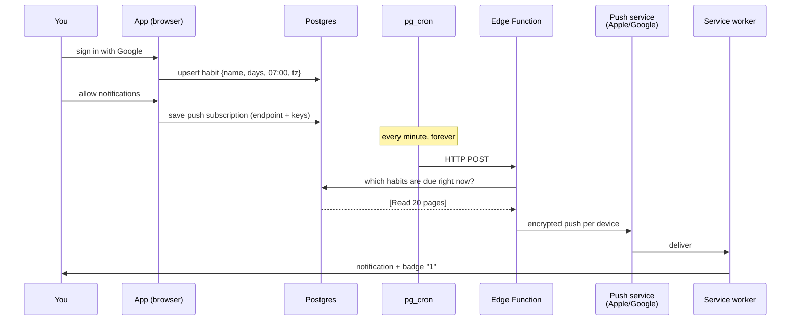
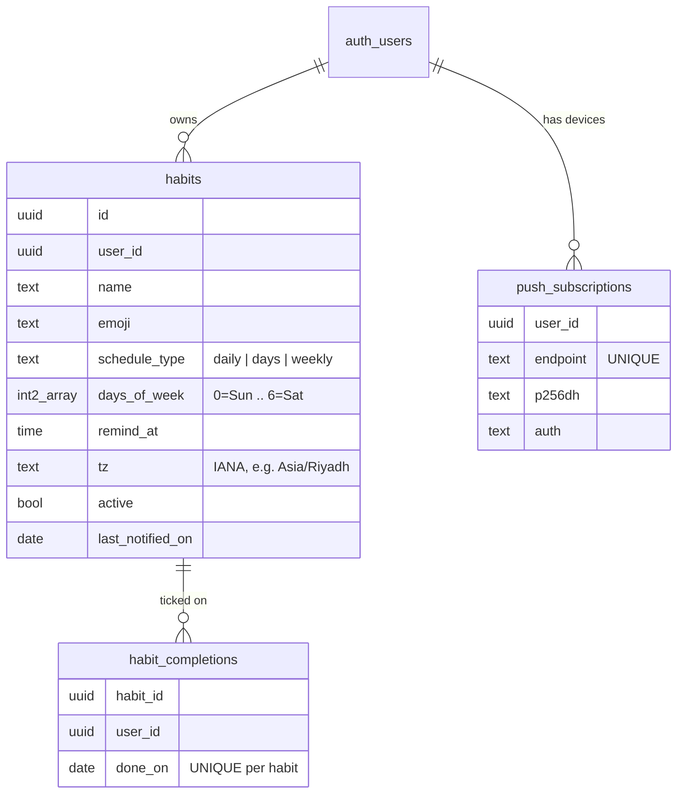
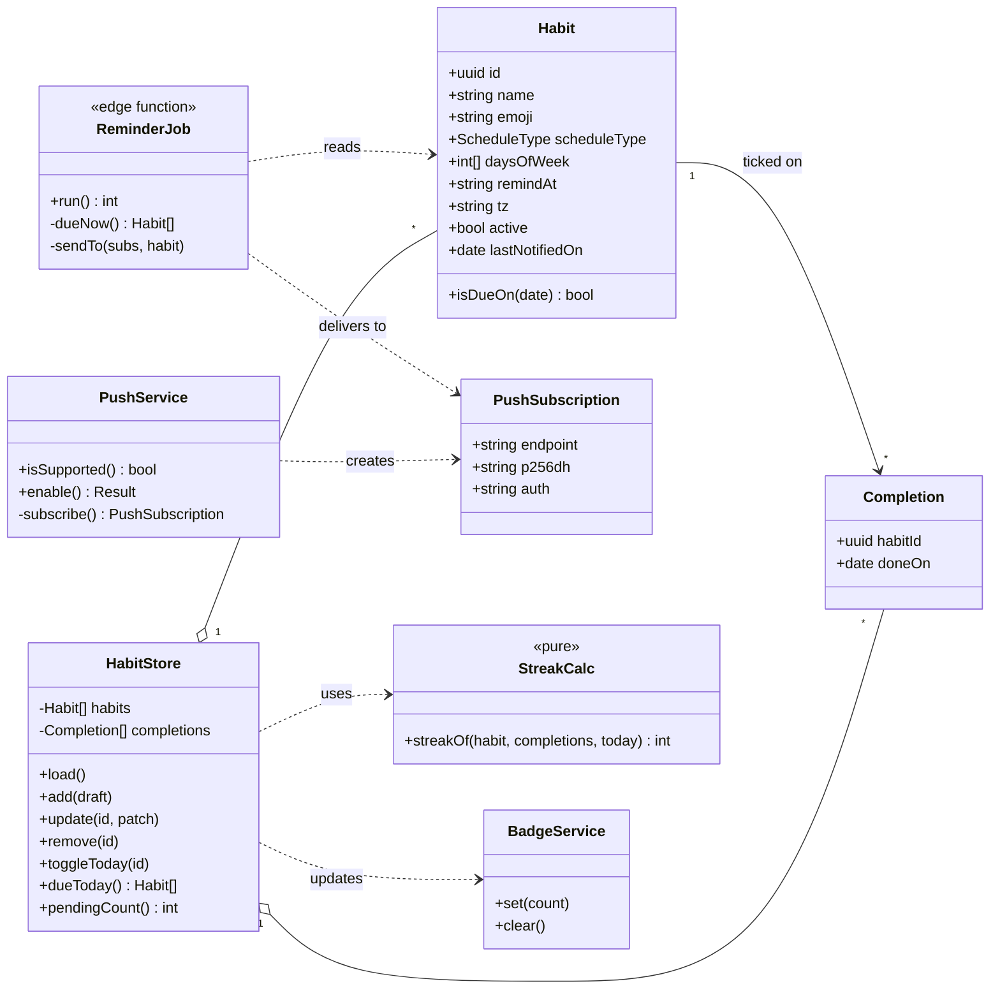
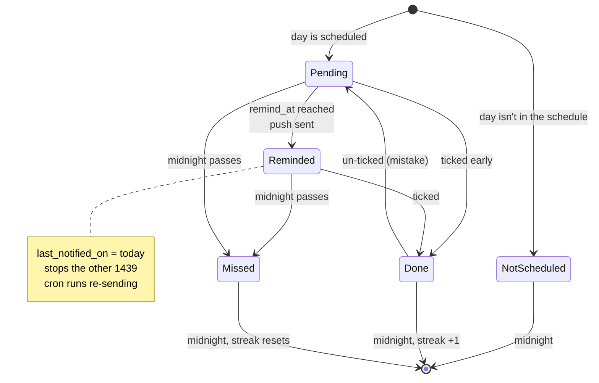
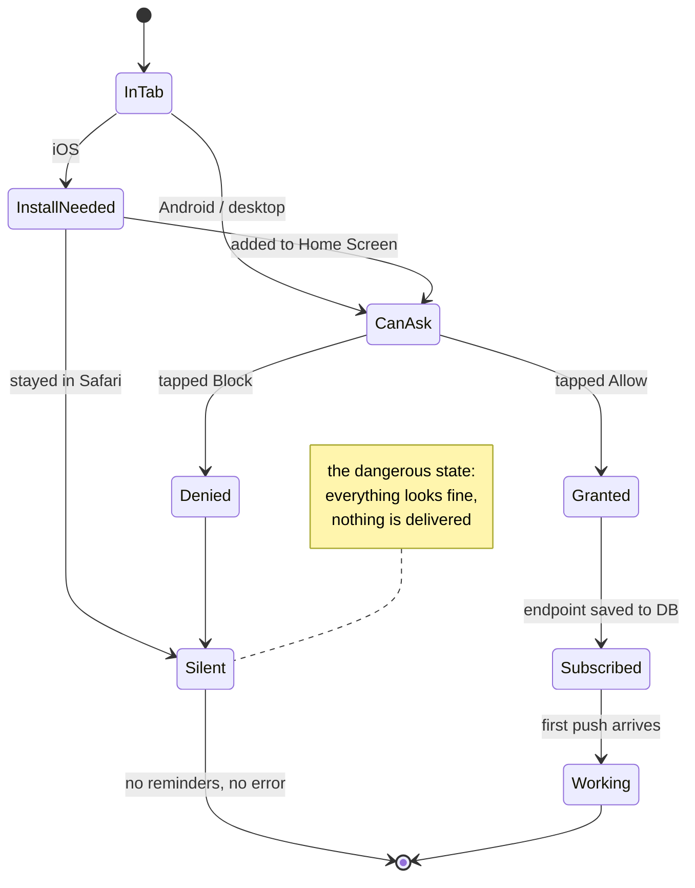
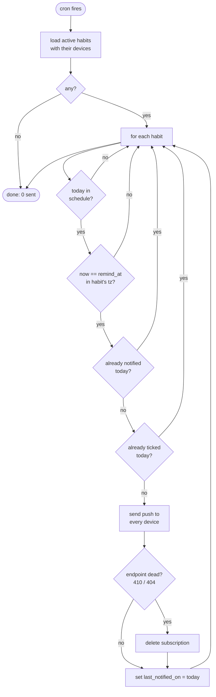
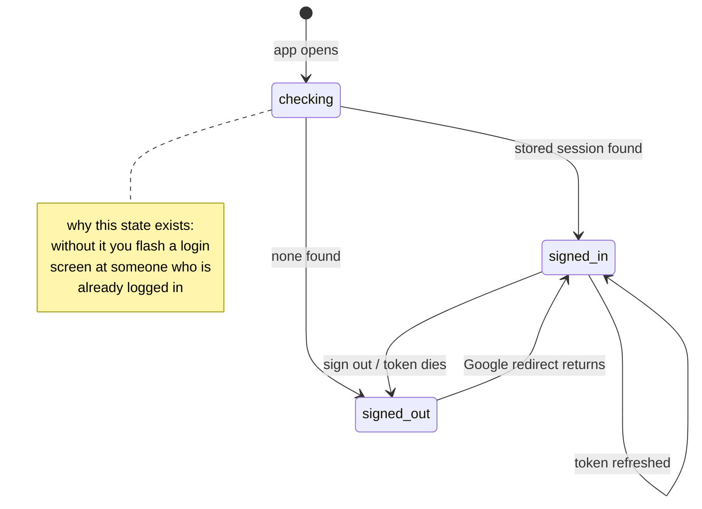
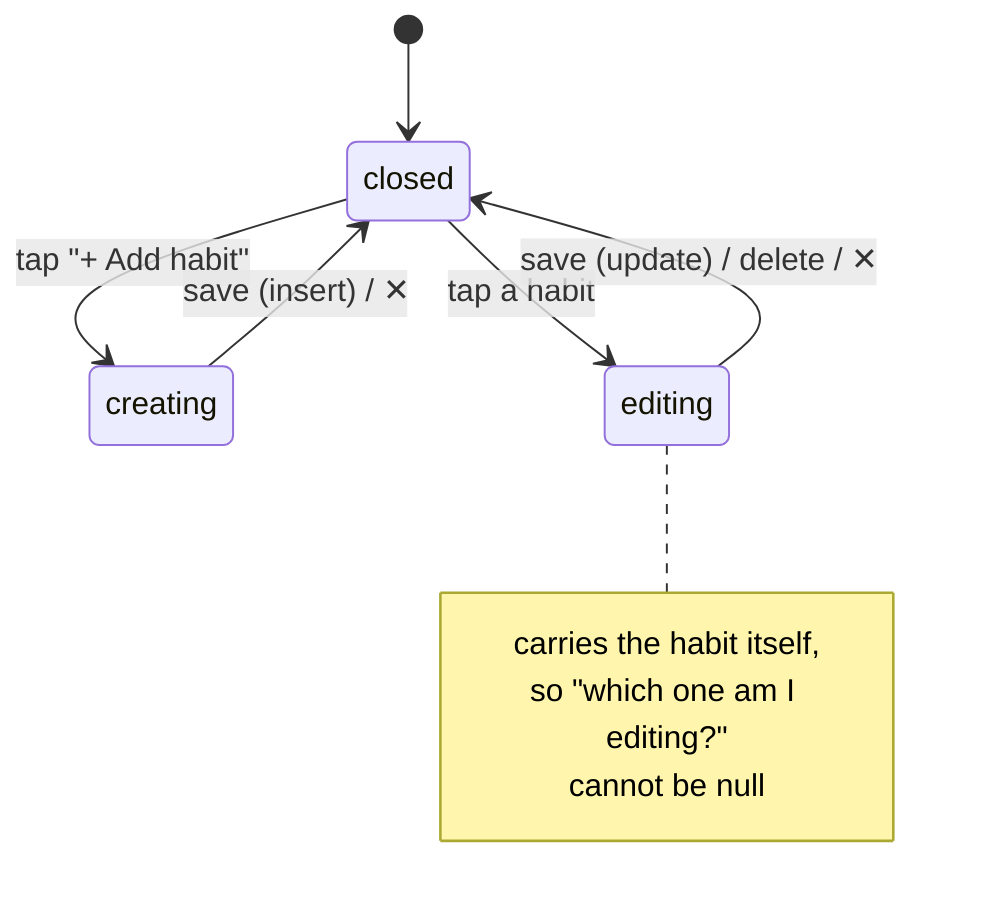
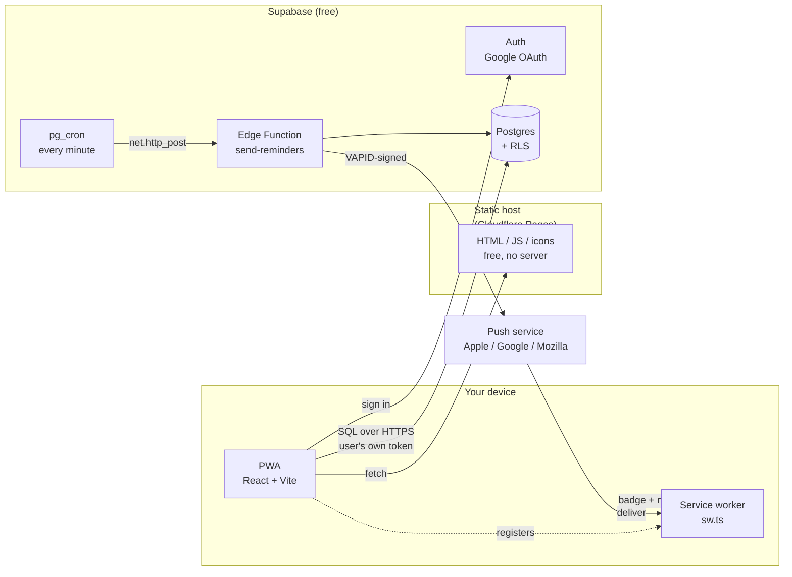

# Habit Tracker — design

An app you install on your phone and your computer. You add habits. It reminds you.
You tick them off. It counts your streak.

Written before the code. Updated after. If code and this file disagree, the code is a bug.

---

## 1. The thing that makes this hard

You would think a web app can say "wake me at 7am tomorrow." **It cannot.**

```
  What you'd expect                    What actually exists
  ─────────────────                    ────────────────────
  setTimeout(remind, 8h)   ✗  the browser tab is closed
  service worker timer     ✗  the OS kills idle workers in seconds
  Notification Triggers    ✗  never shipped; removed from Chrome
```

A service worker is not a program that runs. It is a **doorbell**. It sleeps until
something outside rings it. So something outside must ring it.

```
        needs a clock that never sleeps
                     │
                     ▼
              ┌─────────────┐
              │   SERVER    │  ← the only thing awake at 7am
              └──────┬──────┘
                     │ Web Push
                     ▼
              ┌─────────────┐
              │ service     │  ← wakes up, shows the notification
              │ worker      │
              └─────────────┘
```

**Consequence:** every reminder is a server-sent push. There is no offline reminder.
Habits and tick-offs work offline; *reminders* need the server to be up.

## 2. The second hard thing: iPhones

On iOS, web push works **only if the app is on the Home Screen**. In a Safari tab you
get nothing — no error, no prompt, just silence.

```
  iPhone, Safari tab        iPhone, Home Screen        Android / Desktop
  ──────────────────        ───────────────────        ─────────────────
  push    ✗                 push    ✓ (iOS 16.4+)      push    ✓
  badge   ✗                 badge   ✓                   badge   ✓
```

So "Add to Home Screen" is not a nice-to-have banner. It is **step 1 of onboarding**,
before we even ask for notification permission. We reuse `IosInstallSheet` from
`salat-time` for this.

Order matters — asking permission first, in a tab, burns the prompt:

```
  install  →  ask permission  →  subscribe  →  reminders work
     │              │                │
     └── required   └── needs a      └── sends endpoint
         on iOS         real tap         to the server
```

## 3. How a reminder actually travels



"Due right now" means all four are true:

```
  ┌─ active                                    habit not paused
  ├─ today matches the schedule                daily / Mon,Wed / weekly
  ├─ remind_at == now, in the habit's timezone  07:00 in Asia/Riyadh
  └─ not already notified today                 last_notified_on <> today
```

That last line is the one that stops duplicate pings. Cron runs 1440 times a day; the
flag is what makes 1439 of those runs do nothing.

## 4. Data

Three tables. No user profile table — a Supabase trigger to create one is extra
machinery we can avoid.



Why `tz` sits on the habit, not the user: it means one table instead of two and no
signup trigger. Cost — if you fly to another country your habits still fire on the old
clock until you edit them. Marked in code as a known ceiling.

Why `done_on` is a `date` and not a timestamp: a habit is done *today* or it isn't.
Storing the exact second invites timezone bugs and buys nothing.

**Security:** every table has row-level security — `user_id = auth.uid()`. The browser
talks to Postgres directly with the user's own token, so the database refuses to hand
over anyone else's rows. There is no API layer to get this wrong in.

## 5. Streaks and the badge

```
  Habit: "Read 20 pages"     scheduled Mon Tue Wed Thu Fri
  ─────────────────────────────────────────────────────────
  Mon ✓   Tue ✓   Wed ✓   Thu ✗   Fri ✓   Sat -   Sun -
                            │              │
                    streak broken     streak = 1
```

The streak counts backwards from today over **scheduled days only** and stops at the
first miss. Saturday not being ticked doesn't break a weekday habit, because Saturday
was never scheduled.

The badge is a count of what's left:

```
  setAppBadge( habits due today  −  ticked today )

  3 due, 1 ticked  →  badge 2
  3 due, 3 ticked  →  badge cleared
```

Set in two places, because a badge that only updates when the app is open is a lie:
the service worker sets it when a push arrives, and the app recomputes it on load and
after every tick.

## 6. Screens

Two. Adding a third is how apps get bad.

```
┌──────────────────────────┐      ┌──────────────────────────┐
│  Today          🔥 12    │      │  Edit habit          ✕   │
│                          │      │                          │
│  ┌────────────────────┐  │      │  Name  [Read 20 pages ]  │
│  │ ✓  Read 20 pages   │  │      │  Emoji [📖]              │
│  │    07:00  🔥 12    │  │      │                          │
│  ├────────────────────┤  │ tap  │  Repeat                  │
│  │ ○  Stretch         │──┼─────▶│   ( ) Every day          │
│  │    18:30  🔥 3     │  │      │   (•) Certain days       │
│  ├────────────────────┤  │      │   ( ) Once a week        │
│  │ ○  Call mum        │  │      │                          │
│  │    Sun  🔥 0       │  │      │   [S][M][T][W][T][F][S]  │
│  └────────────────────┘  │      │       ▀▀▀   ▀▀▀   ▀▀▀    │
│                          │      │                          │
│  [ + Add habit ]         │      │  Remind at  [07:00]      │
└──────────────────────────┘      │                          │
                                  │  [ Save ]     [ Delete ] │
                                  └──────────────────────────┘
```

Same two screens as an editable diagram — colours, states, and the layout notes:
**[`docs/screens.drawio`](docs/screens.drawio)**. Open at
[app.diagrams.net](https://app.diagrams.net) (File → Open) or with the *Draw.io
Integration* extension in VS Code. Stored as plain uncompressed XML, so it diffs in a
pull request like code does.

## 7. Layout rules

This project's UI is built with the **[fluid](https://github.com/KhaledTaymour/fluid-skills)**
skill suite for Claude Code — no width breakpoints anywhere.

```
/plugin marketplace add KhaledTaymour/fluid-skills
/plugin install fluid@fluid-skills
```

Which skill did what here:

| Skill | Used for |
|---|---|
| `/fluid-setup` | confirming Tailwind 4 has native container queries and logical utilities |
| `/fluid-tailwind` | checking each utility name against the installed version via context7 |
| `/fluid-build` | the screens — mobile-first, RTL-safe from the first line |
| `/fluid-review` | auditing every `.tsx` and `.css` before commit — clean |

Its seven rules, in one place: [`fluid-shared/references/rules.md`](https://github.com/KhaledTaymour/fluid-skills/blob/main/skills/fluid-shared/references/rules.md).
The thesis is one line — **describe the rule, don't enumerate the widths.**

```
  the habit list          grid auto-fit minmax(18rem, 1fr)
                          1 column on a phone, 2–3 on a desktop,
                          and nobody wrote a breakpoint

  every size              clamp(rem, rem + cqi, rem)
                          scales with its container, respects zoom

  every edge              ms- me- ps- pe- text-start
                          not ml- mr- pl- pr- text-left
                          → Arabic works later for free

  full height             min-h-dvh
                          not h-screen, which hides the Add button
                          under the iOS address bar
```

Verified against Tailwind v4: `@container`, `@sm:`, `@max-md:`, `ms-*`/`me-*`, `h-dvh`/`h-svh` all native, no plugin.

English only for now. Because every edge is logical, adding Arabic later is a
translation file, not a rewrite.

## 8. Why Supabase

One product covers four needs. Everything else needs two or three.

```
              auth    database   cron    push sender
  Supabase     ✓         ✓         ✓         ✓        ← one signup
  Firebase     ✓         ✓        card      ✓
  Cloudflare  DIY        ✓         ✓         ✓
```

Free tier: 500 MB Postgres, 50k monthly users. One catch — **a free project pauses
after ~7 days with no traffic**, and a paused project sends no reminders. Daily use
keeps it awake; a week off does not.

## 9. What we are deliberately not building

| Not building | Add it when |
|---|---|
| Habit categories / tags | you have more than ~15 habits |
| Charts and history views | you have a month of real data |
| Offline queue for ticks | you actually lose a tick to bad signal |
| Multiple reminders per habit | one genuinely isn't enough |
| Arabic | you want it — the layout is already ready |
| Snooze | you find yourself wanting it twice |

---

## 10. UML

### 10.1 Use cases — who wants what

Two actors are people. One is a clock. The clock is the reason this app is more than
a list.

```
                        ┌─────────────────────────────────────────┐
                        │            Habit Tracker                │
                        │                                         │
                        │   ( sign in with Google )               │
     ┌──────┐           │   ( add habit )                         │
     │      │───────────│   ( edit habit )                        │
     │ You  │           │   ( delete habit )                      │
     │      │───────────│   ( tick habit done )                   │
     └──────┘           │   ( see streak )                        │
        │               │   ( install to home screen )            │
        └───────────────│   ( allow notifications )               │
                        │              ▲                          │
                        │              │ «include»                │
                        │   ( subscribe device to push )          │
                        │                                         │
     ┌──────┐           │   ( find habits due now )               │
     │Clock │───────────│              │ «include»                │
     │(cron)│           │              ▼                          │
     └──────┘           │   ( send reminder push )                │
                        │              │ «include»                │
     ┌──────┐           │              ▼                          │
     │Push  │───────────│   ( show notification + badge )         │
     │svc   │           │                                         │
     └──────┘           └─────────────────────────────────────────┘
```

Note "allow notifications" *includes* "subscribe device to push" — permission alone
does nothing. You must also hand the server an address to deliver to.

### 10.2 Classes — what the code is made of



`StreakCalc` is marked pure on purpose: no dates from the clock, no database, no
network. You hand it three values and it returns a number. That is why it is the one
piece with a real test.

### 10.3 State — one habit, one day



`Done → Pending` exists because people mis-tap. Without it, one wrong tap is
permanent, and a tracker you can't correct is a tracker you stop trusting.

### 10.4 State — getting permission

Each arrow is a place users fall out. The dead end is the one worth knowing about.



Because `Silent` looks identical to working, the UI must **say** which state you are
in, and offer a "send me a test push" button. Otherwise the first time you learn it's
broken is the day you needed the reminder.

### 10.5 Activity — what the clock does every minute



Four gates, cheapest first. The expensive step — encrypting and sending a push — only
runs when all four pass. Deleting dead endpoints matters: uninstalled apps leave
addresses that fail forever, and nobody cleans them up but you.

### 10.6 State — the app shell

Four state machines exist in this codebase. Two are above (§10.3 a habit's day, §10.4
permission). The other two live in the UI, and both are written as **union types**, not
booleans — so an impossible state cannot be typed, never mind reached.

**Session** — `SessionState` in `src/App.tsx`:



The same three states as a `loading` plus `user` pair of variables — but that pair can
be `loading: false, user: null` *and* `loading: true, user: {...}`, and one of those is
nonsense. The union has exactly three shapes.

**The form** — `Editing` in `src/components/TodayScreen.tsx`:



`creating` and `editing` are the same form with different exits: one inserts, the other
updates and offers Delete. Modelling them as one state plus a nullable `habitId` is how
you end up updating `undefined`.

Also state-shaped, though not a machine: `deliver()` in the Edge Function returns
`'sent' | 'gone' | 'failed'`, which drives the cleanup branch in §10.5.

### 10.7 Deployment — what runs where



Nothing we run is a server we maintain. The static host serves files. Supabase runs the
clock. The push services are Apple's and Google's. There is no box in this diagram that
we have to keep alive, patch, or pay for at this size.

## 11. Shape of the repo

As built. 19 source files.

```
habit-tracker/
├── DESIGN.md                    this file
├── README.md                    setup, and what to check when nothing arrives
├── docs/screens.drawio          §6 as an editable diagram
├── vite.config.ts               PWA build; injectManifest so we own the worker
│
├── src/
│   ├── sw.ts                    the doorbell: push → notification + badge
│   ├── App.tsx                  session state machine (§10.6)
│   ├── main.tsx                 mount + register the worker
│   ├── index.css                Tailwind 4, safe-area insets, motion-reduce
│   │
│   ├── lib/
│   │   ├── supabase.ts          client + Google sign-in
│   │   ├── push.ts              PushState machine (§10.4), subscribe, test push
│   │   ├── badge.ts             setAppBadge, silent where unsupported
│   │   ├── streak.ts            pure: isDueOn, streakOf
│   │   └── streak.check.ts      13 asserts, `pnpm check`, no framework
│   │
│   ├── stores/habits.ts         zustand; CRUD + optimistic tick + badge sync
│   ├── types/index.ts           Habit, Completion, ScheduleType
│   └── components/
│       ├── SignIn.tsx           one button
│       ├── TodayScreen.tsx      the list; form state machine (§10.6)
│       ├── HabitCard.tsx        tick, name, schedule, streak
│       ├── HabitForm.tsx        new + edit, native time input
│       └── NotificationSetup.tsx  makes §10.4 visible instead of silent
│
└── supabase/
    ├── migrations/
    │   ├── 0001_init.sql        3 tables, CHECK constraints, RLS
    │   └── 0002_reminders.sql   habits_due_now(), mark_notified(), the cron job
    └── functions/send-reminders/
        └── index.ts             encrypt + deliver; prunes dead endpoints
```

### Where each rule ended up enforced

| Decision | Enforced by |
|---|---|
| A habit belongs to one user | RLS policy, not app code |
| Schedule must name a day | `CHECK` constraint in `0001_init.sql` |
| One tick per habit per day | `UNIQUE (habit_id, done_on)` |
| Don't send twice in a day | `last_notified_on` gate in `habits_due_now()` |
| Impossible UI states | union types, not booleans (§10.6) |
| No width breakpoints | `fluid-shared/scripts/scan.mjs`, clean |
