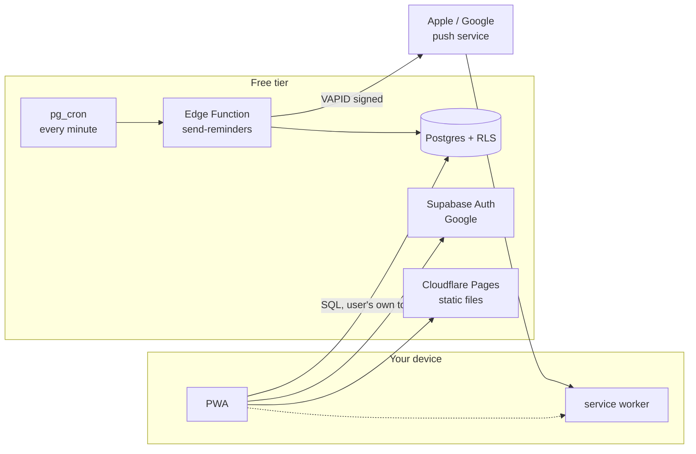
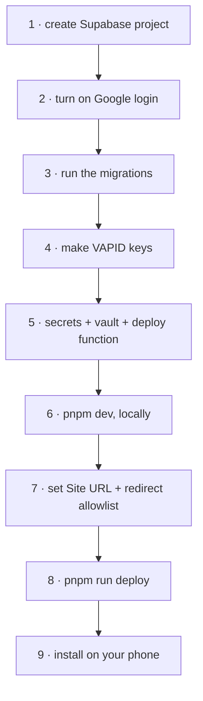

# Habit Tracker

An app you install on your phone and your laptop. Add habits. It reminds you. Tick them
off. It counts your streak.

Design and diagrams: **[DESIGN.md](DESIGN.md)** · Screens: **[docs/screens.drawio](docs/screens.drawio)**

**Status** — verified end to end on macOS and an installed iPhone 13:

```
  ✓  Google sign-in, deployed origin      ✓  push permission + subscribe on iOS
  ✓  test push delivered to both devices  ✓  badge, streaks, activity grid
  ✗  a scheduled reminder firing on its own   ← the one gap that matters
```

The test button skips `habits_due_now()`, so the four gates and the timezone maths have
never run for real. What broke on the way here, and why every failure looked like
success: [DESIGN.md §12](DESIGN.md#12-what-actually-broke).

---

## The one surprising thing

A web app **cannot** wake itself at 7am. No timer survives a closed tab, and the API
that was supposed to fix this never shipped.

```
  a service worker is not a program that runs.
  it is a doorbell. it sleeps until something rings it.

        ┌─────────┐   ring    ┌──────────────┐   show   ┌─────┐
        │ server  │ ───────▶  │ service      │ ──────▶  │ you │
        │ (awake) │  push     │ worker       │          │     │
        └─────────┘           └──────────────┘          └─────┘
             ▲
             │ every minute
        ┌────┴────┐
        │ pg_cron │  ← the only clock in the system
        └─────────┘
```

So every reminder is a push sent by Postgres on a schedule. Habits and streaks work
offline; reminders need the server awake.

**On iPhone, push only works if the app is on the Home Screen.** In a Safari tab you get
silence — no error, no prompt. That's why installing comes before asking permission.

---

## What runs where



Nothing here is a server you keep alive.

---

## Setup

Eight steps. **3, 5 and 7 are the ones that fail silently** — skip any of them and
everything looks fine while nothing is delivered.



**1 · Project** — [supabase.com](https://supabase.com) → New project. Copy the URL and
the `anon` key from Project Settings → API.

**2 · Google login** — Authentication → Providers → Google. Create an OAuth client in
Google Cloud Console, paste the client ID and secret. Add your dev and production URLs
under Authentication → URL Configuration.

**3 · Tables and the clock**

```bash
supabase link --project-ref <your-ref>
supabase db push          # runs all of supabase/migrations/*.sql
```

**4 · VAPID keys** — the identity your pushes are signed with.

```bash
npx web-push generate-vapid-keys
```

**5 · Secrets and the function**

```bash
# the function needs these
supabase secrets set \
  VAPID_PUBLIC_KEY=<public> \
  VAPID_PRIVATE_KEY=<private> \
  VAPID_SUBJECT=mailto:you@example.com

supabase functions deploy send-reminders
```

Then, in the SQL editor, so cron can call the function without the key sitting in plain
SQL:

```sql
select vault.create_secret('https://<your-ref>.supabase.co', 'project_url');
select vault.create_secret('<service-role-key>',             'service_role_key');
```

**6 · Run it**

```bash
cp .env.example .env.local     # fill in URL, anon key, VAPID *public* key
pnpm install
pnpm dev
```

> The private VAPID key and the service-role key are **function secrets**. Never give
> them a `VITE_` prefix — anything `VITE_` is compiled into the bundle and is public.

**7 · URL configuration** — Authentication → URL Configuration. Miss this and Google
sign-in silently redirects to whatever Site URL says, which is how a phone ends up on
`localhost`:

```
  Site URL:        https://<your-project>.pages.dev     ← production; it is the fallback
  Redirect URLs:   https://<your-project>.pages.dev
                   http://localhost:5173               ← keep, or local dev breaks the same way
```

Supabase **discards** a `redirectTo` that isn't on this list and falls back to Site URL,
with no error. That's deliberate: honouring any URL would let an attacker redirect your
session token.

Do this in the dashboard. Do **not** run `supabase config push` — `config.toml` has no
`[auth.external.google]` block, so pushing it would disable Google sign-in.

**8 · Deploy**

```bash
npx wrangler login        # once, in a real terminal — it needs a browser
pnpm run deploy           # build + publish to Cloudflare Pages
```

`pnpm run deploy`, with `run`. Bare `pnpm deploy` is a built-in pnpm command for
workspace packages and does something else entirely.

**9 · Install on your phone** — the order is a requirement, not a suggestion:

```
  1  open the deployed URL in Safari
  2  Share → Add to Home Screen
  3  open it from the ICON, not Safari
  4  sign in with Google
  5  Turn on reminders → Allow
```

A Safari tab and an installed PWA are separate storage contexts. Sign in inside the tab
first and the installed app opens signed out. iOS 16.4+ required.

---

## Did it work?

**Two separate proofs.** The test button calls the sender directly; the scheduled path
goes through cron and the SQL gates. They fail for different reasons, so run both.

```
  A · delivery works        "Send a test"           → buzz within seconds
  B · the clock works       habit 3 min from now    → buzz on its own

     A passing tells you nothing about B: the test skips habits_due_now()
     entirely, so the gates and timezone maths never run.
```

Nothing arrived — work down this list, cheapest first:

| Check | Why |
|---|---|
| "Failed to send a request to the Edge Function" | CORS. The function must answer the `OPTIONS` preflight and repeat the headers on the real reply. `curl` won't reproduce it — curl doesn't preflight. |
| Google login lands on localhost | Supabase discards a `redirectTo` that isn't allowlisted and silently falls back to **Site URL**. Add the deployed origin under Authentication → URL Configuration. |
| Nothing on screen at all | **The OS has its own switch.** System Settings → Notifications → your browser (and a separate "Habit Tracker" row, if the installed app has one) |
| Arrives only in Notification Centre | OS alert style is **None**. Set it to Banners or Alerts. Nothing in the app can detect this |
| Is it installed? (iPhone) | Safari tabs never receive push |
| `select * from cron.job;` | is the minute job scheduled? |
| `select * from cron.job_run_details order by end_time desc limit 5;` | is it firing? **`succeeded` only means the request was queued**, not that the function answered |
| `select status_code, content, created from net._http_response order by created desc limit 5;` | the actual reply. `{"sent":0}` at a minute something was due = a gate rejected it, usually `tz` |
| `supabase functions logs send-reminders` | did it find anyone due? |
| Did the project pause? | free projects sleep after ~7 idle days and send nothing |

---

## Commands

```bash
pnpm dev          # local, service worker enabled
pnpm build        # typecheck + build
pnpm preview      # serve the build locally
pnpm typecheck
pnpm check        # 29 asserts: streak + activity logic, no framework
pnpm run deploy   # build + publish to Cloudflare Pages ('run' is required)
```

Server-side changes need their own deploys — `pnpm run deploy` only ships the front end:

```bash
supabase db push                            # after editing supabase/migrations/
supabase functions deploy send-reminders    # after editing the Edge Function
```

## Layout

Built with **[fluid](https://github.com/KhaledTaymour/fluid-skills)** — a Claude Code
skill suite that keeps UI breakpoint-free and RTL-safe. There is not one width media
query in this codebase.

```
/plugin marketplace add KhaledTaymour/fluid-skills
/plugin install fluid@fluid-skills
```

```
  habit list    grid auto-fit minmax(18rem,1fr)   1 col on a phone, 3 on a desktop
  sizes         clamp(rem, rem + cqi, rem)        scales, respects zoom
  edges         ms- me- ps- pe- text-start        Arabic works later for free
  full height   min-h-dvh                         not h-screen, which hides the
                                                  button under the iOS address bar
```

## Stack

React 19 · TypeScript 7 · Vite 8 · Tailwind 4 · zustand · vite-plugin-pwa · Supabase

MIT.
