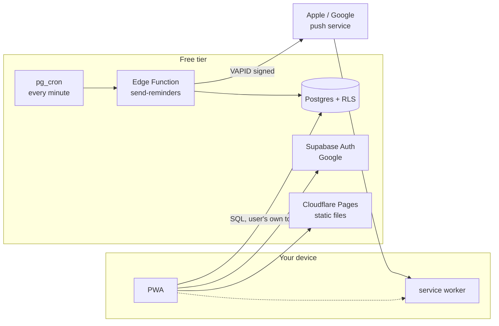
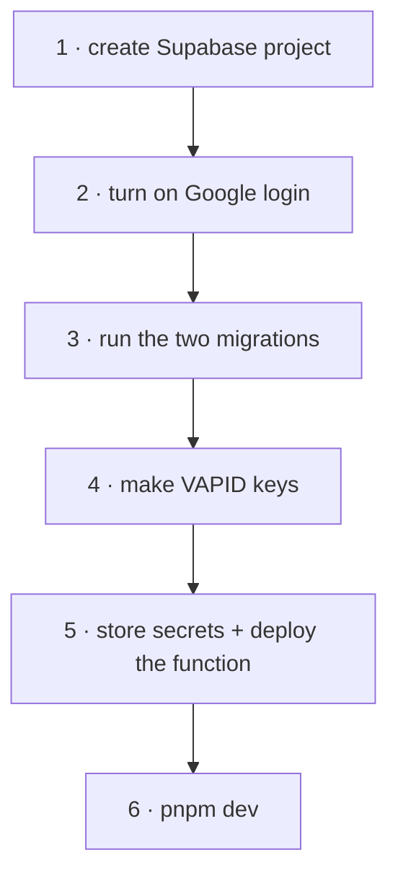

# Habit Tracker

An app you install on your phone and your laptop. Add habits. It reminds you. Tick them
off. It counts your streak.

Design and diagrams: **[DESIGN.md](DESIGN.md)** · Screens: **[docs/screens.drawio](docs/screens.drawio)**

---

## The one surprising thing

A web app **cannot** wake itself at 7am. No timer survives a closed tab, and the API
that was supposed to fix this never shipped.

```
  a service worker is not a program that runs.
  it is a doorbell. it sleeps until something rings it.

        ┌─────────┐   ring    ┌──────────────┐   show   ┌─────┐
        │ server  │ ───────▶  │ service      │ ──────▶  │ you │
        │ (awake) │  push     │ worker       │          │     │
        └─────────┘           └──────────────┘          └─────┘
             ▲
             │ every minute
        ┌────┴────┐
        │ pg_cron │  ← the only clock in the system
        └─────────┘
```

So every reminder is a push sent by Postgres on a schedule. Habits and streaks work
offline; reminders need the server awake.

**On iPhone, push only works if the app is on the Home Screen.** In a Safari tab you get
silence — no error, no prompt. That's why installing comes before asking permission.

---

## What runs where



Nothing here is a server you keep alive.

---

## Setup

Six steps. Steps 3 and 5 are the ones people skip and then wonder why nothing arrives.



**1 · Project** — [supabase.com](https://supabase.com) → New project. Copy the URL and
the `anon` key from Project Settings → API.

**2 · Google login** — Authentication → Providers → Google. Create an OAuth client in
Google Cloud Console, paste the client ID and secret. Add your dev and production URLs
under Authentication → URL Configuration.

**3 · Tables and the clock**

```bash
supabase link --project-ref <your-ref>
supabase db push          # runs supabase/migrations/*.sql
```

**4 · VAPID keys** — the identity your pushes are signed with.

```bash
npx web-push generate-vapid-keys
```

**5 · Secrets and the function**

```bash
# the function needs these
supabase secrets set \
  VAPID_PUBLIC_KEY=<public> \
  VAPID_PRIVATE_KEY=<private> \
  VAPID_SUBJECT=mailto:you@example.com

supabase functions deploy send-reminders
```

Then, in the SQL editor, so cron can call the function without the key sitting in plain
SQL:

```sql
select vault.create_secret('https://<your-ref>.supabase.co', 'project_url');
select vault.create_secret('<service-role-key>',             'service_role_key');
```

**6 · Run it**

```bash
cp .env.example .env.local     # fill in URL, anon key, VAPID *public* key
pnpm install
pnpm dev
```

> The private VAPID key and the service-role key are **function secrets**. Never give
> them a `VITE_` prefix — anything `VITE_` is compiled into the bundle and is public.

---

## Did it work?

```
  sign in  →  add a habit  →  "Turn on reminders"  →  "Send a test"
                                                          │
                          notification within seconds ────┤── yes → done
                                                          └── no  → see below
```

Nothing arrived:

| Check | Why |
|---|---|
| Is it installed? (iPhone) | Safari tabs never receive push |
| `select * from cron.job;` | is the minute job scheduled? |
| `select * from cron.job_run_details order by end_time desc limit 5;` | is it firing, and did it 200? |
| `supabase functions logs send-reminders` | did it find anyone due? |
| Did the project pause? | free projects sleep after ~7 idle days and send nothing |

---

## Commands

```bash
pnpm dev         # local, service worker enabled
pnpm build       # typecheck + build
pnpm preview     # serve the build (test install + push here)
pnpm typecheck
pnpm check       # streak logic self-check
```

## Layout

Built with **[fluid](https://github.com/KhaledTaymour/fluid-skills)** — a Claude Code
skill suite that keeps UI breakpoint-free and RTL-safe. There is not one width media
query in this codebase.

```
/plugin marketplace add KhaledTaymour/fluid-skills
/plugin install fluid@fluid-skills
```

```
  habit list    grid auto-fit minmax(18rem,1fr)   1 col on a phone, 3 on a desktop
  sizes         clamp(rem, rem + cqi, rem)        scales, respects zoom
  edges         ms- me- ps- pe- text-start        Arabic works later for free
  full height   min-h-dvh                         not h-screen, which hides the
                                                  button under the iOS address bar
```

## Stack

React 19 · TypeScript 7 · Vite 8 · Tailwind 4 · zustand · vite-plugin-pwa · Supabase

MIT.
